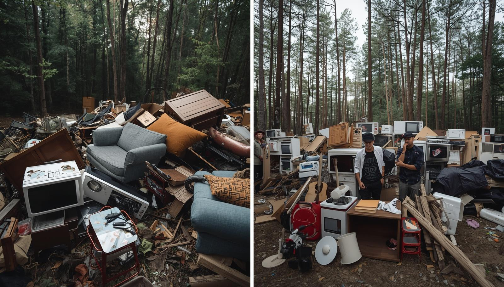
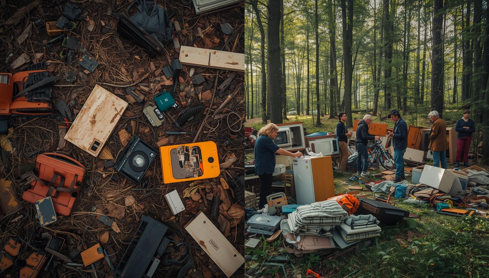
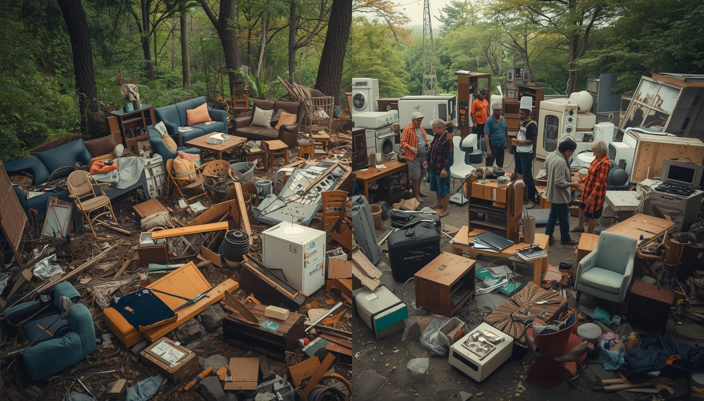
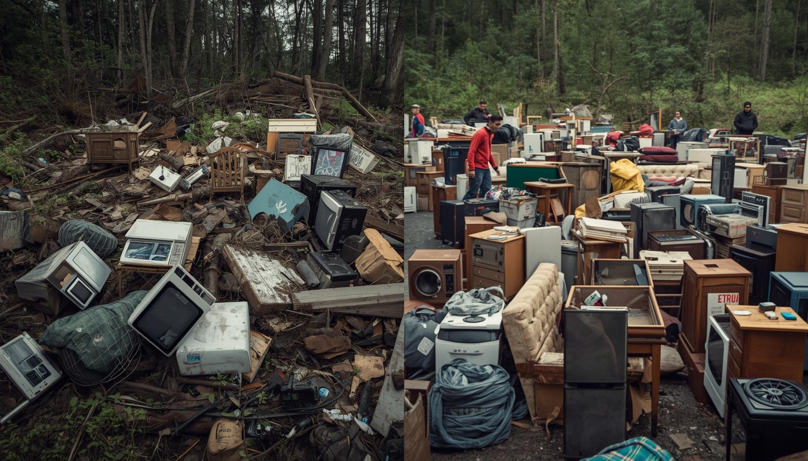

<!DOCTYPE html>
<html lang="fr">
<head>
  <meta charset="UTF-8">
  <meta name="viewport" content="width=device-width, initial-scale=1.0">
  <title>RécupèreMoi – Donnez une seconde vie à vos objets</title>

  <!-- Typographie moderne -->
  <link href="https://fonts.googleapis.com/css2?family=Inter:wght@400;500;600&display=swap" rel="stylesheet">

  
</head>

<body>

  <!-- NAVBAR -->
  <nav>
    
RécupèreMoi

    <ul>
      <li><a href="index.html">Accueil</a></li>
      <li><a href="deposer.html">Déposer un objet</a></li>
      <li><a href="dons.html">Voir les dons</a></li>
      <li><a href="apropos.html">À propos</a></li>
      <li><a href="contact.html">Contact</a></li>
    </ul>
  </nav>

  <!-- HERO -->
  

    

      <h1>Donnez une seconde vie à vos objets</h1>
      
RécupèreMoi connecte les dons aux personnes et associations qui en ont besoin. Gratuit, simple et solidaire.

      <a href="dons.html" class="btn-primary">Voir les dons disponibles</a>
    

    
  

  <!-- POURQUOI -->
  <section>
    <h2>Pourquoi utiliser RécupèreMoi ?</h2>

    

      

        <h3>🎁 Donnez facilement</h3>
        
Déposez un objet en quelques secondes. Aucune vente, aucun échange, juste du don.

      

      

        <h3>📍 Autour de vous</h3>
        
Consultez les dons disponibles près de chez vous grâce à la recherche intelligente.

      

      

        <h3>🤝 Pour tous</h3>
        
Particuliers, associations, ressourceries : tout le monde peut donner ou récupérer.

      

      

        <h3>🌱 Impact positif</h3>
        
Réduisez les déchets et favorisez le réemploi solidaire.

      

    

  </section>

  <!-- COMMENT ÇA MARCHE -->
  <section>
    <h2>Comment ça marche ?</h2>

    

      

        <h3>1. Déposez un objet</h3>
        
Ajoutez une photo, une description et votre ville.

      

      

        <h3>2. Il apparaît sur la plateforme</h3>
        
Les utilisateurs proches peuvent le voir immédiatement.

      

      

        <h3>3. Contact direct</h3>
        
Une personne intéressée vous contacte par email.

      

      

        <h3>4. Vous donnez</h3>
        
Simple, gratuit, solidaire.

      

    

  </section>

  <!-- GALERIE -->
  <section>
    <h2>Notre communauté en images</h2>

    

      
      
      
      
    

  </section>

  <!-- FOOTER -->
  <footer>
    
RécupèreMoi — Plateforme de dons gratuits

    
© 2026 — Tous droits réservés

  </footer>

</body>
</html>
