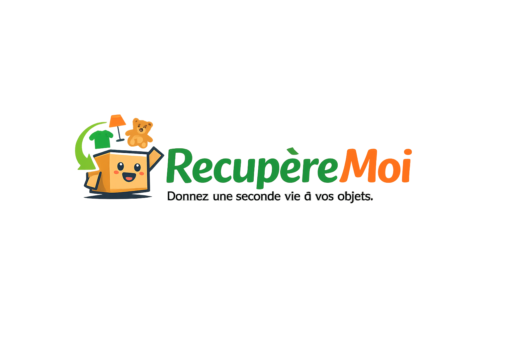

<!DOCTYPE html>
<html lang="fr">
<head>
  <meta charset="UTF-8">
  <title>RecupèreMoi - Donnez une seconde vie à vos objets</title>
  <meta name="viewport" content="width=device-width, initial-scale=1">

  
</head>

<body>

<!-- MENU -->
<nav>
  <a href="index.html">Accueil</a>
  <a href="https://tally.so/r/ODJrVY" target="_blank">Déposer un objet</a>
  <a href="apropos.html">À propos</a>
  <a href="faq.html">FAQ</a>
  <a href="contact.html">Contact</a>
</nav>

<header>
  
  <h1>RecupèreMoi</h1>
  
La plateforme qui connecte vos objets inutilisés aux Ressourceries et associations près de chez vous.

  <a href="https://tally.so/r/ODJrVY" class="btn" target="_blank">Déposer un objet</a>
</header>

  <section class="fade-in">
    <h2>❗ Le problème</h2>
    
Aujourd’hui, donner un objet, c’est souvent compliqué :

    <ul>
      <li>On ne sait pas où aller</li>
      <li>On ne sait pas si la structure accepte l’objet</li>
      <li>On n’a pas toujours un véhicule</li>
      <li>Les Ressourceries manquent de visibilité</li>
    </ul>
  </section>

  <section class="fade-in">
    <h2>💡 La solution RecupèreMoi</h2>
    
Donner devient simple, en 3 étapes :

    <ul>
      <li>Vous décrivez votre objet</li>
      <li>Vous indiquez votre ville</li>
      <li>Nous vous orientons vers la Ressourcerie la plus proche qui l’accepte</li>
    </ul>
    
C’est simple, rapide et gratuit.

  </section>

  <section class="fade-in">
    <h2>🌱 Pourquoi RecupèreMoi est différent</h2>
    <ul>
      <li>Priorité aux Ressourceries et structures solidaires</li>
      <li>Bilan d’impact pour chaque don (CO₂ évité, ressources préservées)</li>
      <li>Mise en relation directe avec les acteurs du réemploi</li>
      <li>Soutien aux emplois d’insertion</li>
    </ul>
  </section>

  <section class="fade-in" id="don">
    <h2>📦 Déposer un objet</h2>
    
Pour déposer un objet, cliquez ici :

    <a href="https://tally.so/r/ODJrVY" class="btn" target="_blank">Accéder au formulaire</a>
  </section>

  <section class="fade-in">
    <h2>ℹ️ À propos</h2>
    
RecupèreMoi est une initiative solidaire qui facilite le don d’objets et soutient les Ressourceries partout en France. Notre mission : réduire les déchets, encourager le réemploi et rendre le don accessible à tous.

  </section>

<footer>
  

    
<strong>RecupèreMoi</strong> – Donnez une seconde vie à vos objets.

    

      <a href="index.html">Accueil</a> •
      <a href="apropos.html">À propos</a> •
      <a href="faq.html">FAQ</a> •
      <a href="contact.html">Contact</a>
    

    

      Projet solidaire de réemploi
